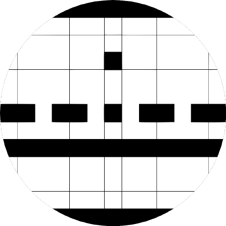

  

<h1 align="center">Hi, I'm Samuel Oberger Rockenbach</h1>

  <strong>Full Stack Developer</strong> with a focus on web development. 
  Passionate about technology and innovation — writing <strong>clean code</strong> is my vocation.

  
  
  

---

### 🧑‍💻 About Me

I turn innovative ideas into impactful digital experiences. With command of web development — from frontend to backend — I build performant, secure, and well-structured applications. I enjoy designing developer tooling and sharing it as open source.

---

### 🛠️ Tech Stack & Tools

<strong>Languages</strong>

  

<strong>Frontend &amp; Styling</strong>

  

<strong>Backend &amp; Runtimes</strong>

  

<strong>Databases</strong>

  

<strong>DevOps &amp; Tools</strong>

  

<strong>API &amp; Testing</strong>

  

---

<em>Clean code is not written by following a set of rules — it is a craft worth practicing every day.</em>

